# 📱 캠퍼스 줍줍 (Campus ZupZup)

  

    대학생을 위한 분실물 통합 관리 플랫폼
  

---

 
대학생들은 교내에서 물건을 잃어버리거나 주웠을 때, 에브리타임이나 단체 채팅방을 통해 정보를 공유하는 경우가 많습니다.
하지만 게시글이 쉽게 묻히고, 검색이 어렵고,
신분증·학생증과 같은 민감한 개인정보가 노출될 위험도 존재합니다.

<strong>캠퍼스 줍줍</strong>은 이러한 문제를 해결하기 위해
<strong>분실물과 습득물 정보를 한 곳에서 안전하게 관리</strong>하고,
<strong>자동 알림을 통해 빠른 연결</strong>을 돕는 대학생 전용 분실물 플랫폼입니다.

---

## 🛠️ 팀 멤버
<table align="center" style="width: 90%; margin: auto; font-size: 1.1rem;">
  <tr>
    <td align="center">
      <h3>조예영</h3>
      
디자인

    </td>
    <td align="center">
      <h3>김경동</h3>
      
iOS

    </td>
    <td align="center">
      <h3><strong>주현아</strong></h3>
      
iOS · 서버

    </td>
  </tr>
</table>

## 📖 캠퍼스 줍줍 주요 기능 플로우

### 1. ✨ 스플래시 화면
    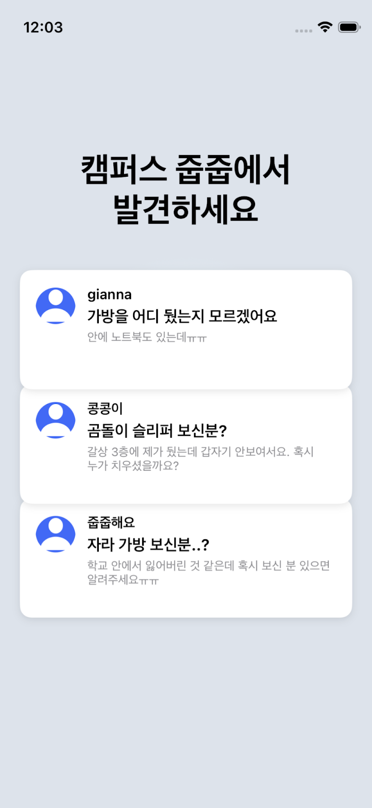

- 앱 실행 시 브랜드 아이덴티티 제공
- 최근 등록된 분실물 게시글 미리보기 제공
- 사용자가 앱 진입 전에도 최신 분실물 정보 확인 가능

### 2. 🏠 홈 화면
    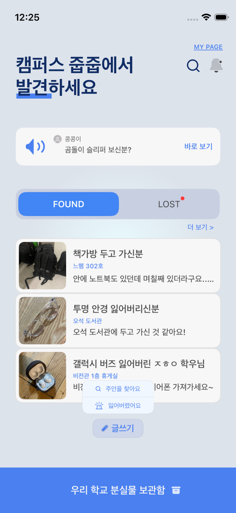 

- 최근 분실물 광고 배너 노출
- 분실물 / 습득물 최신 게시글 리스트 제공
- 글쓰기 버튼을 통한 게시물 등록
- 검색 및 알림 페이지 접근 가능

### 3. 📝 분실물 · 습득물 게시물 등록
   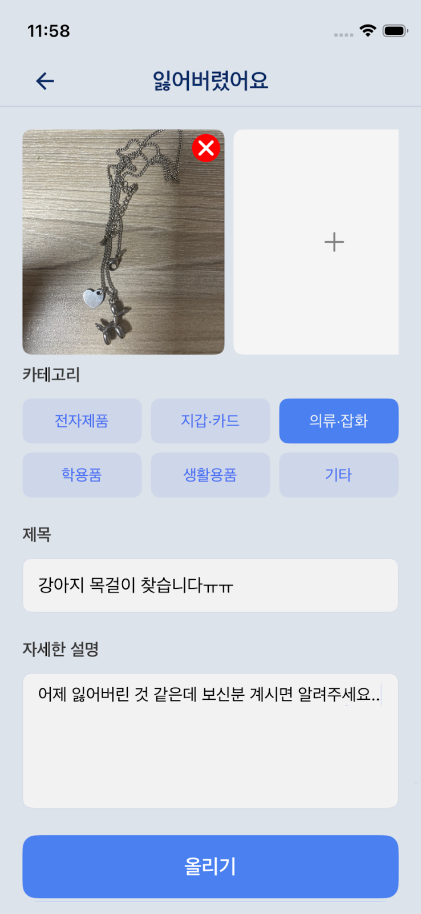 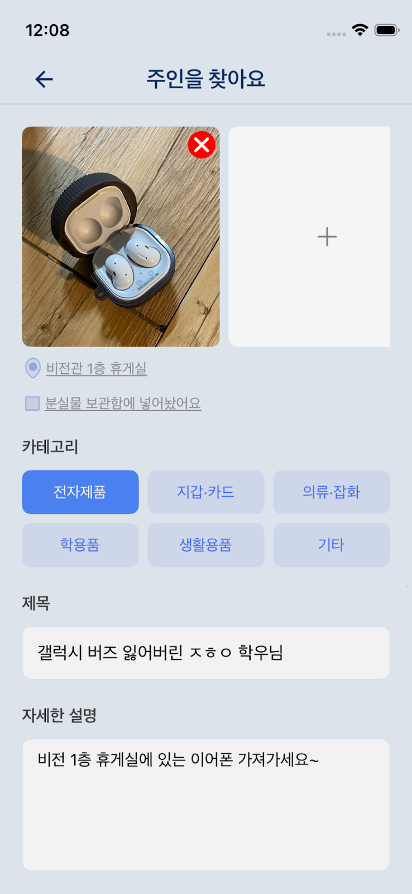 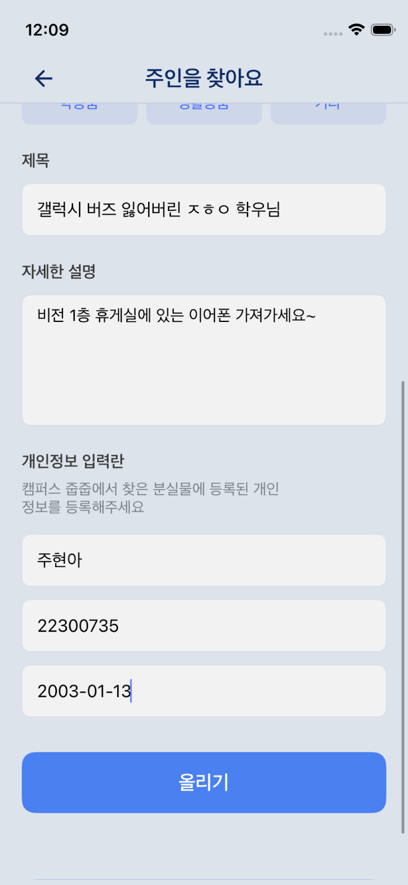

- 분실물 등록: 사진, 카테고리, 제목, 설명 입력
- 습득물 등록: 습득 장소, 보관함 위탁 여부, 사진, 카테고리, 제목, 설명 입력 (개인정보 입력 시 자동 매칭 알림 전송)

### 4. 📋 분실물 · 습득물 리스트 조회
   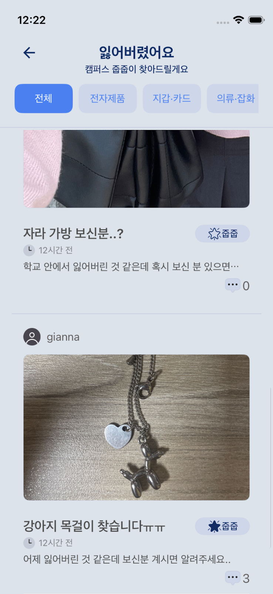 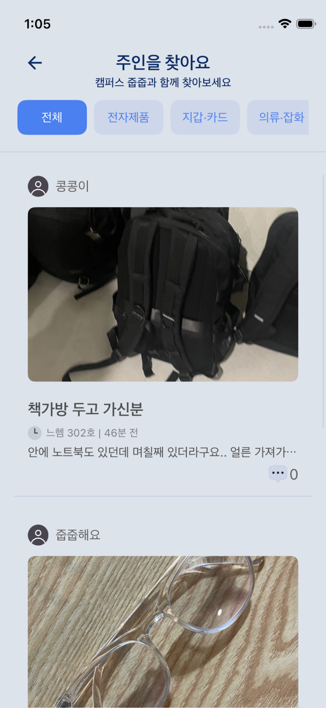 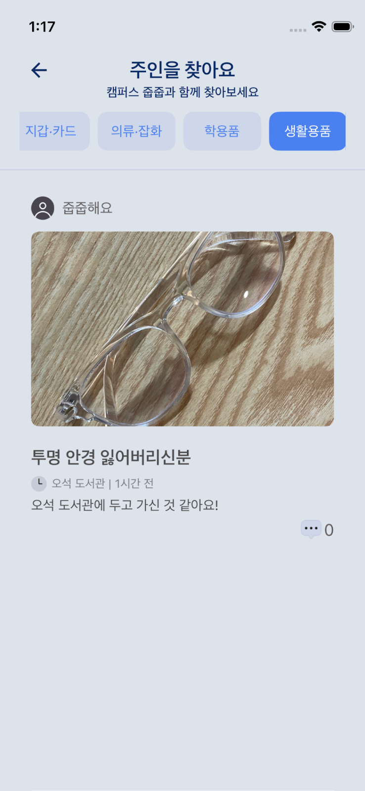 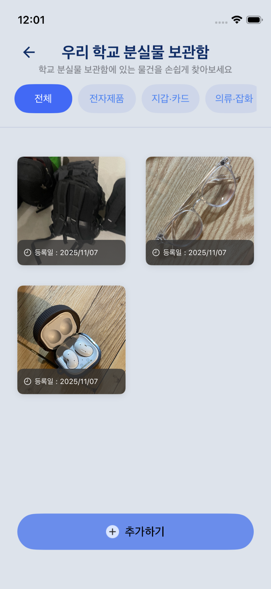

- 분실물 / 습득물 게시글을 카테고리별로 한눈에 조회
- 게시물 상태를 줍줍 뱃지 색상로 직관적으로 표시
- 사진, 위치, 작성자 닉네임, 댓글 수 함께 제공
- 교내 분실물 보관함에 보관 중인 물품은 별도로 조회 가능

### 5. 📄 게시물 상세 페이지 & 댓글
   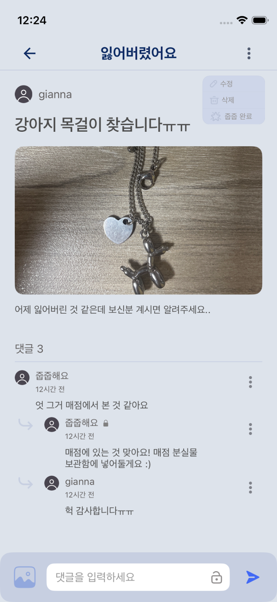 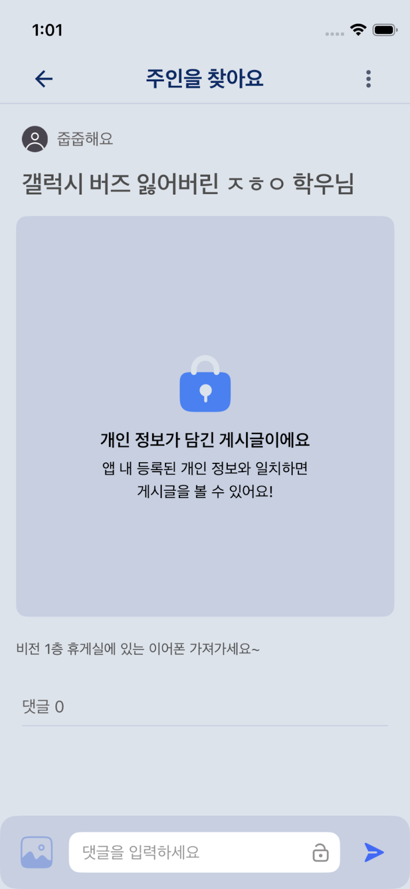 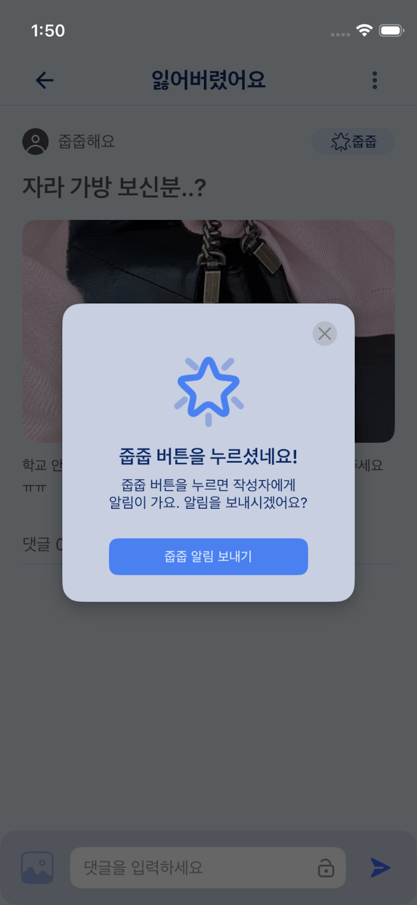

- 게시물 상세 정보 조회
- 개인정보 보호 기능 (게시물 작성자가 개인정보를 입력한 경우, 학번 or 이름 & 생년월일이 일치하는 사용자만 게시물 사진 열람 가능)
- 댓글 및 대댓글 작성
- 비밀 댓글 기능 제공
- (분실물 게시물) 줍줍 완료 버튼 클릭시, 작성자에게 자동 알림 발송 

### 6. 🔔 알림 기능
    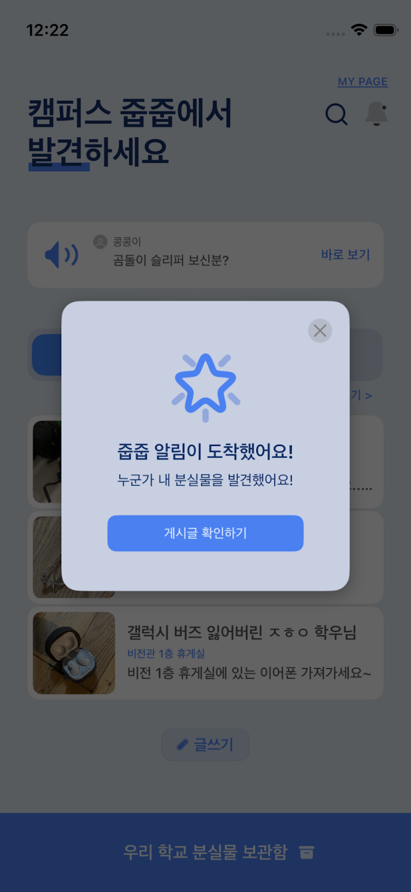 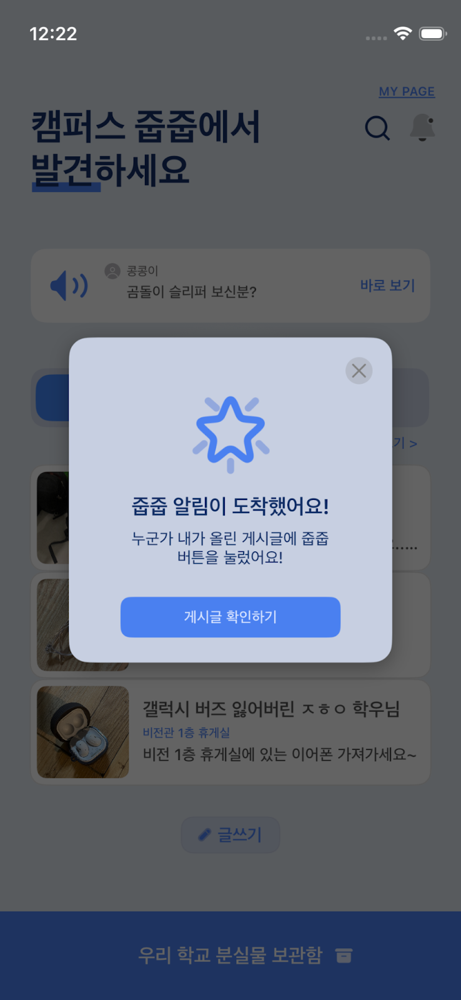

<댓글 알림 (알림 페이지에서 조회 가능)>
- 작성한 게시글에 댓글이 달린 경우 

<줍줍 알림 (알림 페이지, 홈 화면에서 조회 가능)>
- 본인 정보와 일치하는 습득물 게시글이 등록된 경우
- 작성한 분실물 게시글에서 누군가 줍줍 버튼을 누른 경우

### 7. 👤 본인이 작성 및 댓글 단글 조회 & 검색
   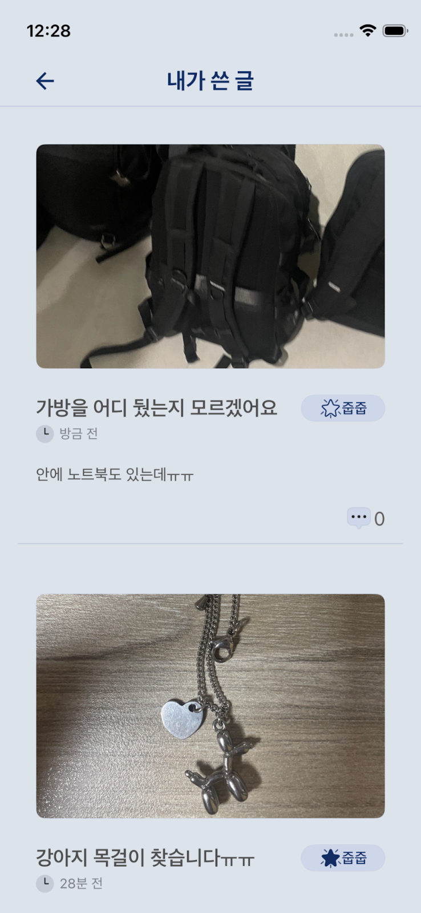 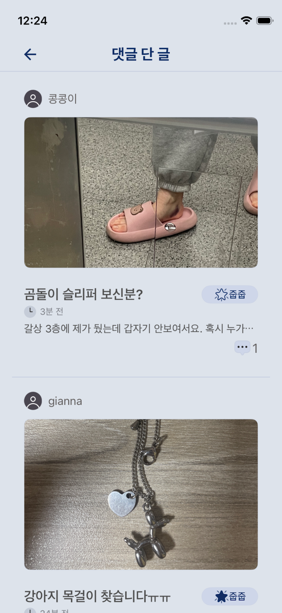 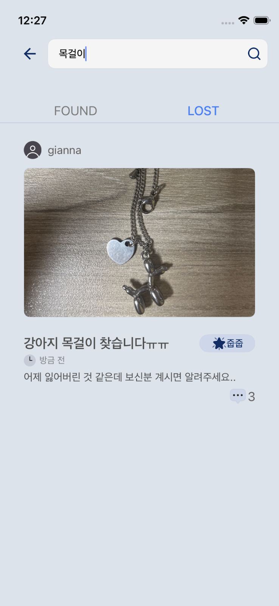

- 내가 쓴 글 / 댓글 단 글 조회
- 게시물 검색 기능 제공

## 🌟 캠퍼스 줍줍의 핵심 가치
- 🔔 분실자와 회원정보 매칭시, 자동 알림발송을 통한 빠른 분실물 회수
- 🔐 개인정보 보호 중심 설계
- 🔎 통합된 분실물 검색 경험
- 🏫 대학생 커뮤니티에 특화된 서비스 구조

## 🚀 추가 개발 계획
- 푸시 알림 기능
- 재학생 인증 절차 도입
- 실시간 채팅 기능
- 게시물 URL 공유
- 다국어(영어) 지원

## 🧠 기술 스택
- iOS (UIKit)
- Spring Boot (REST API /JWT 토큰 인증)
- MySQL

캠퍼스 줍줍과 함께 교내 분실물을 쉽고 안전하게 찾아보세요!